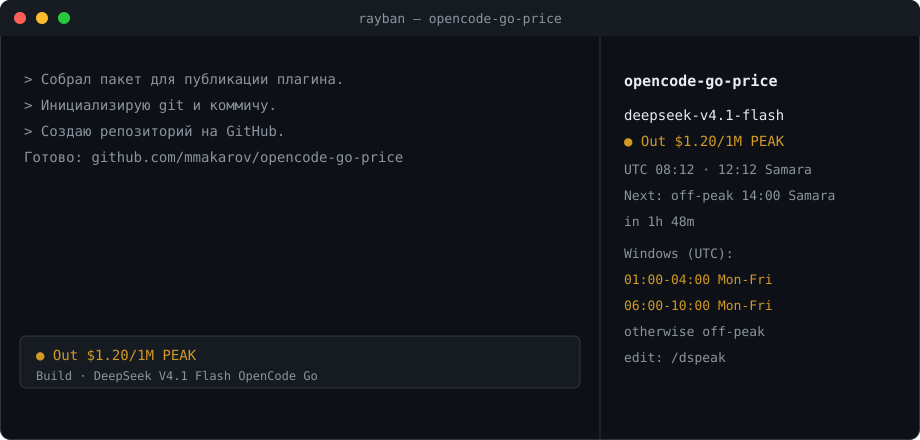

# opencode-go-price

An [OpenCode](https://opencode.ai) TUI plugin that shows the **current model's
output price** and the **DeepSeek peak / off-peak windows** right in the
interface.

It is forked from [`ds-peak-warningx`](https://github.com/Bashar-AlGhada/opencode-ds-peak-warning)
by [Bashar](https://github.com/Bashar-AlGhada) (MIT) and adds the per-model
output price.



## Features

- Rolling **5-hour OpenCode Go limit** as a phone-style battery bar, e.g.
  `$0.60 ● 5h █████████░ 89%`.
- The output price (`$`, no unit) is colored by peak / off-peak.
- DeepSeek peak / off-peak status, next switch and countdown.
- Local time taken from the machine's timezone (`Intl`), so "Next" is shown in
  your own timezone.
- Hidden automatically when the active model is **not** served by `opencode-go`
  (or has no known price).
- Peak windows are editable in-app with `/dspeak` and persist across restarts.

## Quota

The battery reads your OpenCode Go credentials from the environment (same
variables as `@whosydd/opencode-quota`):

```bash
export OPENCODE_GO_WORKSPACE_ID="wrk_..."
export OPENCODE_GO_AUTH_COOKIE="Fe26.2**..."
```

Without them the indicator falls back to the model's output price. The values
are the ones from your browser session on <https://opencode.ai/auth>.

## Install

**From a local clone** (works today): clone this repo and point your TUI config
(`~/.config/opencode/tui.json`) at the entry file.

```bash
git clone https://github.com/mmakarov/opencode-go-price
```

```json
{
  "$schema": "https://opencode.ai/tui.json",
  "plugin": ["/absolute/path/to/opencode-go-price/src/index.tsx"]
}
```

**By package name** (after it is published to npm):

```json
{
  "$schema": "https://opencode.ai/tui.json",
  "plugin": ["opencode-go-price"]
}
```

Restart OpenCode. The indicator appears next to the session prompt; the panel
appears in the sidebar when it is visible (`ctrl+x b`).

## Model selection compatibility

On OpenCode 1.18.30 the composer selection lives in `LocalProvider`, while the
public plugin state exposes saved sessions and messages. The adapter in
`src/selected-model.ts` reads that local reactive context from the mounted slot.
It follows model and agent changes before submission, without consulting old
messages or the shared recent-models file. Non-Go selections hide both widgets;
switching back to Go restores them. If the host's context shape changes, the
widgets hide instead of showing a stale price. This adapter depends on internals
of [OpenCode v1.18.30](https://github.com/anomalyco/opencode/blob/v1.18.30/packages/tui/src/context/local.tsx).

Regression checks (Node with TypeScript stripping support):

```bash
node --conditions=browser --test tests/selected-model.test.mjs
```

## Peak windows

Default DeepSeek schedule (UTC): `01:00-04:00` and `06:00-10:00`, Monday to
Friday; weekends are fully off-peak. Run `/dspeak` to edit or reset, e.g.
`06:00-10:00 Mon-Fri`.

## Price table

Output prices (USD per 1M tokens) live in `src/goprice.ts`. They are a static
table based on the OpenCode Go pricing page; update them there when prices
change. DeepSeek applies a peak multiplier (about 2x off-peak).

## Attribution

Based on [`ds-peak-warningx`](https://github.com/Bashar-AlGhada/opencode-ds-peak-warning)
by Bashar, MIT licensed. See `LICENSE`.

## License

MIT
